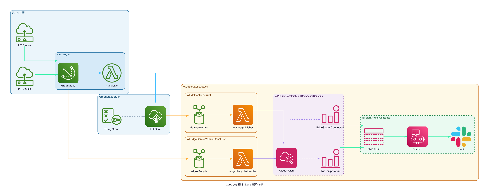

# CDKで実現するIoT管理体制

AWS CDK (TypeScript) を使って、Raspberry Pi 上の AWS Greengrass v2 と CloudWatch 監視体制を**コードで一元管理**するプロジェクトです。

---

## アーキテクチャ



### スタック構成

| スタック | 役割 |
|---------|------|
| `GreengrassStack` | IoT Thing Group・IoT Policy・Greengrass コンポーネント・デプロイメントを管理 |
| `IotObservabilityStack` | IoT Rule・Lambda・CloudWatch アラーム/ダッシュボード・SNS・Chatbot を管理 |

---

## プロジェクト概要

### 注力ポイント

**① Greengrass IoT を CDK で管理**

Raspberry Pi（エッジサーバー）へのコンポーネントデプロイを CDK で定義。
`cdk deploy` 1コマンドで Greengrass コンポーネントのバージョンアップやデプロイメント更新が可能。

**② CloudWatch 監視体制の整備**

| 監視項目 | 内容 |
|---------|------|
| 温度センサー | デバイス温度が 80°C を超えたらアラーム |
| エッジサーバー死活 | Greengrass が 5 分以上オフラインでアラーム |
| Slack 通知 | アラーム発火時に AWS Chatbot 経由で Slack へ通知 |
| ダッシュボード | CloudWatch ダッシュボードで全デバイスを一覧表示 |

### MQTT トピック設計

ステージ別に分離するため、トピックにステージ名を含めています。

```
iot/{stage}/devices/{deviceId}/temperature   # センサー → Greengrass
iot/{stage}/devices/{deviceId}/metrics       # Greengrass Lambda → IoT Core
```

---

## 前提条件

- Node.js 22.x 以上
- AWS CLI（デプロイ先アカウントで認証済み）
- AWS CDK v2
- Raspberry Pi に AWS Greengrass v2 がインストール済み
- AWS Chatbot で Slack ワークスペースの認可が完了済み（後述）

```bash
npm install -g aws-cdk
```

---

## デプロイ前の手動作業（AWS コンソール）

### 1. AWS Chatbot — Slack ワークスペース認可

CDK でのデプロイ前に、コンソールで Slack を認可する必要があります。

1. [AWS Chatbot コンソール](https://console.aws.amazon.com/chatbot/) を開く
2. **Configured clients** > **Slack** > **Configure new client**
3. Slack ワークスペースを認可
4. ワークスペース ID とチャンネル ID をメモする

### 2. `bin/app.ts` に Slack ID を設定

```typescript
// bin/app.ts
slackWorkspaceId: "YOUR_SLACK_WORKSPACE_ID",  // 例: TXXXMM8AN4
slackChannelId:   "YOUR_SLACK_CHANNEL_ID",    // 例: C00XX9VA3PP
```

### 3. Greengrass コアデバイスの登録

Raspberry Pi を IoT Thing として登録し、Thing Group に追加します。
Thing 名は `iot-observability-edge-server-{stage}-{連番}` の形式を推奨します。

---

## デプロイ手順

### 1. 依存パッケージのインストール

```bash
npm install
```

### 2. `cdk.json` にステージ設定を追加

```json
{
  "context": {
    "stage": "dev",
    "dev": {
      "stage": "dev"
    }
  }
}
```

### 3. CDK Bootstrap（初回のみ）

```bash
npx cdk bootstrap --context stage=dev
```

### 4. デプロイ

```bash
# 全スタックをデプロイ
cdk deploy --all --context stage=dev

# スタックを個別にデプロイ
npx cdk deploy GreengrassStackDEV --context stage=dev
npx cdk deploy IotObservabilityStackDEV --context stage=dev

# プロファイル指定
npx cdk deploy IotObservabilityStackDEV --profile test-profile --context stage=dev

```

### 5. 差分確認

```bash
npx cdk diff --all --context stage=dev
```

---

## CDK スタック詳細

### GreengrassStack

```
GreengrassStack
├── Iot               # IoT Thing Group + IoT Policy
├── Component         # Greengrass Lambda コンポーネント (handler.ts)
└── Deploy            # Thing Group へのデプロイメント定義
                      #   (Greengrass Nucleus / LogManager / LegacySubscriptionRouter 含む)
```

### IotObservabilityStack

```
IotObservabilityStack
├── IoTSlackNotifierConstruct       # SNS Topic + AWS Chatbot → Slack
├── IoTMetricsConstruct             # IoT Rule + Lambda (metrics-publisher)
├── IoTAlarmsConstruct              # 高温アラーム + CompositeAlarm
├── IoTEdgeServerMonitorConstruct   # ライフサイクルイベント監視
└── IoTDashboardConstruct           # CloudWatch ダッシュボード
```

---

## 開発コマンド

```bash
npm run build     # TypeScript コンパイル
npm run watch     # ファイル変更を監視してコンパイル
npm run test      # Jest ユニットテスト
npx cdk synth     # CloudFormation テンプレートの生成（デプロイなし）
```

---

## ドキュメント

| ファイル | 内容 |
|---------|------|
| [docs/mqtt-messages.md](docs/mqtt-messages.md) | MQTT トピック・ペイロード仕様 |
| [docs/sa_drawio.png](docs/system_drawio.png) | アーキテクチャ図 |
